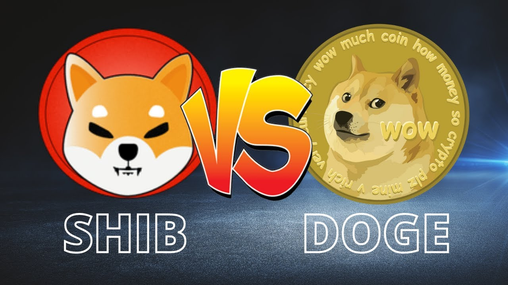

<h1 align="center">
 
</h1>

# Shiba_vs_Doge
My exploration into meme cryptos  
Ed. 1
## Scope: Purpose / Goals / Value
I've been itching for my next side project, and I think I've found it in this. My purpose for this project is to sharpen my skills and explore more deeply data mining, automation, modeling, ML, visualizations, and dashboarding. I am certainly open to feedback and I hope to build/collaborate on something special here. So what am I aiming for? This will get more specific with further iterations and updates. Stay tuned! 
### Goals
In no particular order, here are the milestones that I am currently aiming for. 
<ul>
  <li> 
<strong>In process: </strong>
Create an automated web scraper that regularly gathers information about the meme stocks Shiba Inu and Dogecoin, and established crypto Etherium.</li>
  <li> Create dataframes to analyze the performance of these cryptos over time and generate various visualizations to demonstrate and compare cryptos.</li>
  <li> Utilize ML to analyze and attempt to model the various cryptos current/possible future behavior. (Given their volatile nature I expect this will be like exploring chaos theory--locally predictable, long-term who knows?) See future steps for additional thoughts.</li>
  <li> Create a dashboard to illustrate these findings.</li> 
</ul> 
  
## In Process 
<ul>
  <li>Compiling initial sources for data points.</li>
  <li>Building initial scraper to gather data points to-date (25 June 2021).</li>
  <li>Compiling dataframes for to-date (25 June 2021) and deciding on data storage</li>
  <li>Modify scraper for gathering future data points (post 25 June 2021).</li>
  <li>Automate mining process.</li>
</ul>

## Resources
1. For context, and banner credit: *War of Cryptocurrencies : Shiba Inu (SHIB) VS Dogecoin (DOGE)* https://steemit.com/bitcoin/@murliwala/war-of-cryptocurrencies-shiba-inu-shib-vs-dogecoin-doge
  
## Future Steps
1. I am curious if other variables that can have high impact on cryptos can be explained within this project. Specifically, I am curious if I can describe the impact of Elon Musk tweets on performance--perhaps even allow for that in the modeling process. This is currently already an ambitious project and this would take it to another level. 
